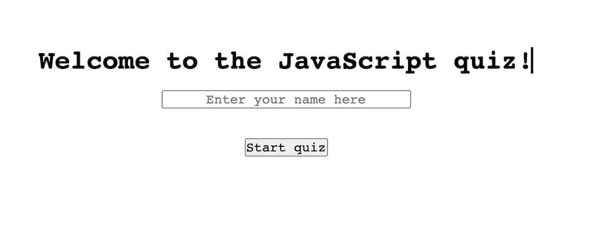
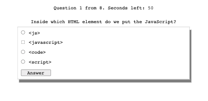
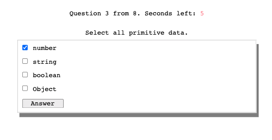
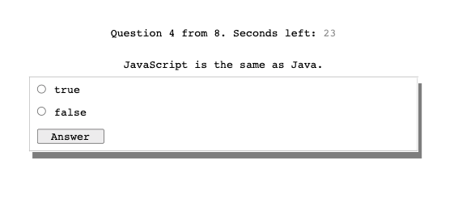
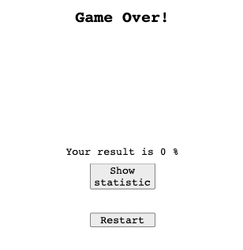

# Code Quiz web app. Homework #4

Password generator is a web application which was created as part of Homework #4. 
The application was developed to test th knoledge of the JavaScrip language.  
For the development, the knowledge gained in the process of studding Web APIs was used.

## Usage

The project was deployed using Github hosting and is available 
at the link https://kas500.github.io/code-quiz/.

On the main page of the application, the user is prompted to enter his name 
and start testing by pressing the appropriate button "Start quiz". (pic. 1)

The quiz provides single choice (pic. 2), multiple choice (pic. 3) and true/false questions (pic. 4).  
After passing the test, the screen displays: the test result, the button 
to view the statistics of the best results and the button to restart the test (pic. 5).

### Picture 1

### Picture 2

### Picture 3

### Picture 4

### Picture 5

## License

MIT License